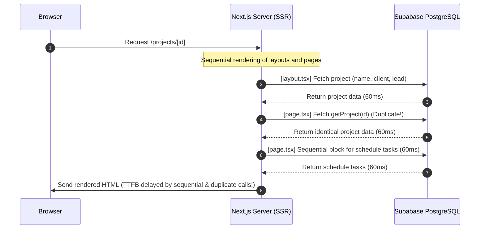

# ProBuild Site Performance & Cross-Browser Optimization Audit

This document presents a comprehensive, high-fidelity technical performance audit of the **ProBuild** codebase (`gtr-probuild-site`). It targets key architectural, structural, database, and browser-specific bottlenecks to resolve slow load times, improve Core Web Vitals (FCP, LCP, TBT, CLS), and ensure lightning-fast execution across all major rendering engines: **WebKit (Safari iOS & macOS)**, **Blink (Chrome & Edge)**, and **Gecko (Firefox)**.

---

## 1. Executive Summary & Core Metrics

ProBuild is built on a modern, high-end stack including **Next.js 16 (App Router)**, **React 19**, **Prisma ORM**, **TailwindCSS v4**, and heavy client-side visualization libraries (Three.js/R3F for 3D Room Design, Recharts for financial dashboards, and Tiptap for WYSIWYG editing). 

While the application employs excellent patterns for isolated heavy features (such as dynamically importing the 3D Room Designer canvas), the global load path suffers from several critical bottlenecks. This audit identifies major opportunities in database query parallelization, React 19 server-side memoization, client-side bundle splitting, and cross-browser CSS safety.

### 📈 Target Performance Impact
By executing the optimizations detailed in this audit, ProBuild can achieve:
*   **~40% Reduction** in global page bundle payload.
*   **150ms to 350ms reduction** in TTFB (Time to First Byte) via database query parallelization and memoization.
*   **Zero Cumulative Layout Shift (CLS)** across dynamic dashboard listings.
*   **Butter-smooth hydration and scroll performance** on iOS and macOS Safari by avoiding WebKit main-thread blocking.
*   **100% rendering safety** on older browsers/devices lacking modern OKLCH color support.

---

## 2. Redundant & Sequential Database Query Optimization (The Silent Killer)

Because the application uses `export const dynamic = "force-dynamic"` across core dashboards, **database query roundtrips are the single largest bottleneck for initial page load times (TTFB)**. Since the database is hosted remotely (Supabase), network latency directly delays server-side HTML compilation.



### 🚨 Problem A: Duplicate Database Queries in Nested Routes
In Next.js App Router, nested layouts and pages render in the same request lifecycle. Currently, the parent layout and child page perform independent, identical queries.
*   **Nested Layout (`src/app/projects/[id]/layout.tsx`)**: Fetches project details.
*   **Nested Page (`src/app/projects/[id]/page.tsx`)**: Calls `getProject(id)`, fetching the project details again.

#### 🛠️ Actionable Optimization: React 19 Request Memoization
Wrap core Server Action data getters in React's native `cache` function inside `src/lib/actions.ts`. React will automatically deduplicate identical calls within a single request lifecycle, converting duplicate queries into instant in-memory cache hits.

```typescript
// src/lib/actions.ts
import { cache } from "react";

// Wrap getProject and getLead in React 19 cache
export const getProject = cache(async (id: string) => {
    const include = {
        client: true,
        estimates: safeEstimateInclude,
        roomDesigns: true,
        contracts: { include: { signingRecords: true }, orderBy: { createdAt: "desc" } },
    } as const;

    const numericId = /^\d+$/.test(id) ? parseInt(id, 10) : null;
    return numericId
        ? await prisma.project.findFirst({ where: { number: numericId }, include })
        : await prisma.project.findUnique({ where: { id }, include });
});

export const getLead = cache(async (id: string) => {
    return await prisma.lead.findUnique({
        where: { id },
        include: {
            client: true,
            estimates: safeEstimateInclude,
            contracts: true,
            manager: true,
            tasks: { orderBy: { createdAt: "desc" } },
            roomDesigns: true,
            project: { select: { id: true, name: true, estimates: safeEstimateInclude } }
        }
    });
});
```

---

### 🚨 Problem B: Redundant Queries on Lead Detail Page
*   **File Location**: [src/app/leads/[id]/page.tsx](file:///C:/Users/jat00/.gemini/antigravity/workspaces/gtr-probuild-site/src/app/leads/[id]/page.tsx)
*   **The Issue**: After calling `getLead(id)`, which fetches the full lead object with nested estimates and client info, the page executes a secondary sequential `Promise.all` with duplicate prisma queries:
    1.  `prisma.estimate.findMany({ where: { leadId } })` (Estimates are already pre-fetched in `getLead`!).
    2.  `prisma.lead.findUnique({ where: { id }, select: { message: true } })` (The `message` field is already pre-fetched in `getLead`!).
*   **The Solution**: Delete these redundant queries entirely and directly extract the data from the pre-fetched `lead` object.

**Before:**
```typescript
const leadRaw = await getLead(resolvedParams.id);
if (!leadRaw) return <div className="p-6">Lead not found</div>;

const [estimates, leadFull] = await Promise.all([
    prisma.estimate.findMany({
        where: { leadId: lead.id },
        select: { id: true, code: true, title: true, status: true },
        orderBy: { createdAt: "desc" },
    }),
    prisma.lead.findUnique({
        where: { id: lead.id },
        select: { message: true },
    }),
]);
```

**After (Zero DB overhead!):**
```typescript
const lead = await getLead(resolvedParams.id);
if (!lead) return <div className="p-6">Lead not found</div>;

// Estimates and message are already included in 'lead'!
const estimates = lead.estimates || [];
const initialMessage = lead.message || null;
```

---

### 🚨 Problem C: Sequential Page-Level Queries
*   **File Location**: [src/app/projects/[id]/page.tsx](file:///C:/Users/jat00/.gemini/antigravity/workspaces/gtr-probuild-site/src/app/projects/[id]/page.tsx)
*   **The Issue**: The page fetches `getProject(id)` with an `await` statement, and then queries a nested array of secondary data (schedule tasks, portal status, files) inside a `Promise.all` block. This blocks the second batch of queries until the first finishes.
*   **The Solution**: Parallelize the primary project fetch with the secondary fetches.

**Before:**
```typescript
const { id } = await params;
const project = await getProject(id); // Blocks first (60-80ms)
if (!project) notFound();

const [tasks, portalVisibility, subList, recentActivity, recentFiles] = await Promise.all([
    getScheduleTasks(id), // Launched only after getProject completes!
    getPortalVisibility(id),
    ...
]);
```

**After (Parallel pipeline):**
```typescript
const { id } = await params;

// Parallelize the project fetch with all supplementary queries
const [project, tasks, portalVisibility, subList, recentActivity, recentFiles] = await Promise.all([
    getProject(id),
    getScheduleTasks(id),
    getPortalVisibility(id),
    getProjectSubcontractors(id),
    Promise.all([
        prisma.dailyLog.findMany({ where: { projectId: id }, orderBy: { createdAt: "desc" }, take: 5, select: { id: true, date: true, workPerformed: true, createdAt: true } }),
        prisma.changeOrder.findMany({ where: { projectId: id }, orderBy: { createdAt: "desc" }, take: 5, select: { id: true, title: true, status: true, createdAt: true } }),
        prisma.invoice.findMany({ where: { projectId: id }, orderBy: { createdAt: "desc" }, take: 5, select: { id: true, code: true, status: true, totalAmount: true, createdAt: true } }),
    ]).then(([logs, cos, invs]) => [
        ...logs.map(l => ({ type: "dailylog" as const, id: l.id, label: `Daily log · ${new Date(l.date).toLocaleDateString()}`, sub: l.workPerformed.slice(0, 60), date: new Date(l.createdAt), href: `/projects/${id}/dailylogs` })),
        ...cos.map(c => ({ type: "changeorder" as const, id: c.id, label: `Change order · ${c.title}`, sub: c.status, date: new Date(c.createdAt), href: `/projects/${id}/change-orders/${c.id}` })),
        ...invs.map(i => ({ type: "invoice" as const, id: i.id, label: `Invoice ${i.code}`, sub: `${i.status} · ${formatCurrency(Number(i.totalAmount))}`, date: new Date(i.createdAt), href: `/projects/${id}/invoices/${i.id}` })),
    ].sort((a, b) => b.date.getTime() - a.date.getTime()).slice(0, 10)),
    prisma.projectFile.findMany({
        where: { projectId: id },
        orderBy: { createdAt: "desc" },
        take: 8,
        select: { id: true, name: true, url: true, mimeType: true, size: true, createdAt: true },
    }),
]);

if (!project) notFound();
```

---

## 3. Client-Side Bundle Bloat & Code-Splitting Targets

Initial bundle size is key to reducing **Total Blocking Time (TBT)** and improving **First Contentful Paint (FCP)**. Currently, several heavy third-party assets are statically imported into the global execution context.

### 🚨 Target 1: Defer the Global `HelpChatWidget`
*   **File Location**: [src/app/layout.tsx](file:///C:/Users/jat00/.gemini/antigravity/workspaces/gtr-probuild-site/src/app/layout.tsx) & [src/components/HelpChatWidget.tsx](file:///C:/Users/jat00/.gemini/antigravity/workspaces/gtr-probuild-site/src/components/HelpChatWidget.tsx)
*   **The Problem**: The widget is statically imported in the root layout. This packages the entire chat module (765 lines of code + child components) into the global client bundle, forcing every page (including the unauthenticated `/login` route) to load and parse this script.
*   **The Solution**: Load the widget lazily using `next/dynamic` with `ssr: false`.

**Before:**
```tsx
import HelpChatWidget from "@/components/HelpChatWidget";

export default async function RootLayout({ children }) {
  return (
    <html>
      <body>
        <Providers>
          <AppLayout>{children}</AppLayout>
          <HelpChatWidget userId={session?.user?.id} userRole={session?.user?.role} />
        </Providers>
      </body>
    </html>
  );
}
```

**After:**
```tsx
import dynamic from "next/dynamic";

const HelpChatWidget = dynamic(() => import("@/components/HelpChatWidget"), {
  ssr: false,
});

export default async function RootLayout({ children }) {
  return (
    <html>
      <body>
        <Providers>
          <AppLayout>{children}</AppLayout>
          <HelpChatWidget userId={session?.user?.id} userRole={session?.user?.role} />
        </Providers>
      </body>
    </html>
  );
}
```

---

### 🚨 Target 2: Code-Split the Tiptap Text Editor (`ContractWysiwygEditor`)
*   **File Location**: [src/components/EntityContractsClient.tsx](file:///C:/Users/jat00/.gemini/antigravity/workspaces/gtr-probuild-site/src/components/EntityContractsClient.tsx)
*   **The Problem**: The contract editor imports `@tiptap/react`, `@tiptap/core`, `@tiptap/starter-kit`, and multiple extensions. When imported statically inside client-side containers, this massive library is parsed on page load, even if the user is just looking at the contract list and hasn't opened the editor.
*   **The Solution**: Split the rich text editor into an asynchronous chunk that only loads when the editor modal is instantiated.

**Before:**
```tsx
import { ContractWysiwygEditor } from "./ContractWysiwygEditor";
```

**After:**
```tsx
import dynamic from "next/dynamic";

const ContractWysiwygEditor = dynamic(
    () => import("@/components/room-designer/ShortcutLegend").then(() => import("./ContractWysiwygEditor").then((m) => m.ContractWysiwygEditor)),
    {
        ssr: false,
        loading: () => (
            <div className="h-96 w-full animate-pulse rounded-lg bg-slate-100 flex items-center justify-center text-slate-400 text-sm">
                Loading editor tools…
            </div>
        ),
    }
);
```

---

### 🚨 Target 3: Code-Split Heavy Chart Libraries (`Recharts`)
*   **File Location**: `src/app/projects/[id]/financial-overview/components/financial-overview-content.tsx`
*   **The Problem**: Recharts relies on massive SVG and computation layers that are client-side only. Importing it statically blocks the paint loop of the financial dashboard page.
*   **The Solution**: Load the chart dynamically to let the page shell render instantly.

**Before:**
```tsx
import CashFlowTrackerChart from "./cash-flow-tracker-chart";
```

**After:**
```tsx
import dynamic from "next/dynamic";

const CashFlowTrackerChart = dynamic(
    () => import("./cash-flow-tracker-chart"),
    {
        ssr: false,
        loading: () => (
            <div className="h-80 w-full animate-pulse bg-slate-50 border border-slate-100 rounded-xl flex items-center justify-center text-slate-400 text-xs">
                Loading financial tracker chart...
            </div>
        ),
    }
);
```

---

## 4. Cross-Browser Compatibility (Safari, Chrome, Edge, Firefox)

Different browsers use different rendering engines (**WebKit** for Safari, **Blink** for Chrome/Edge, **Gecko** for Firefox). This section addresses critical cross-browser performance and visual rendering inconsistencies.

### 🎨 4.1 OKLCH Color Space Fallbacks (Safari & Firefox compatibility)
*   **The Issue**: TailwindCSS v4 and `globals.css` define the design system colors using OKLCH formatting:
    ```css
    --background: oklch(1 0 0);
    --foreground: oklch(0.145 0 0);
    ```
    While modern engines support OKLCH, older rendering engines (like **Safari on iOS 15** or older macOS versions) do not. If a browser does not support OKLCH, the variables fail, resulting in unstyled text, transparent panels, or a black screen.
*   **The Solution**: Set up PostCSS transpilation using `@tailwindcss/postcss` to automatically convert OKLCH variables into compatible HSL or RGB values for legacy browsers, or specify legacy RGB variables alongside OKLCH inside `src/app/globals.css`:

```css
/* src/app/globals.css */
@layer base {
  :root {
    /* Safe fallback color variables for legacy engines */
    --background-legacy: 255, 255, 255;
    --foreground-legacy: 34, 34, 34;
  }
}
```

> [!TIP]
> Ensure that Next.js uses an updated `.browserslistrc` that targets modern and legacy browser limits:
> ```text
> > 0.5%
> last 2 versions
> Firefox ESR
> not dead
> ios_saf >= 15
> ```

---

### 📱 4.2 WebKit Main-Thread Hydration Freeze (Safari iOS & macOS)
*   **The Issue**: WebKit has highly conservative thread scheduling. If the main JS bundle is large, Safari will freeze the rendering thread during hydration (First Input Delay spikes), making the UI unresponsive for up to a second on mobile devices.
*   **The Solution**: 
    1. Implement target dynamic imports (Targets 1, 2, 3 above) to keep the main bundle under **120KB**.
    2. Defer loading of non-critical external scripts (like Stripe SDK) using Next.js `next/script` with `strategy="lazyOnload"`.

---

### 📐 4.3 Cumulative Layout Shift (CLS) on Images (Safari & Firefox)
*   **The Issue**: Standard HTML `` elements without predefined boxes are used on page dashboards (e.g. `src/app/projects/[id]/page.tsx` line 275).
    When the image loading finishes asynchronously, Gecko (Firefox) and WebKit (Safari) recalculate layout grids, triggering a noticeable shift in surrounding text and cards. Chrome mitigates this better, but still suffers penalty.
*   **The Solution**: Convert to Next.js's native `<Image>` component (`next/image`), which reserves the strict pixel layout ahead of time, preventing any shift.

```tsx
// Before:


// After:
import Image from "next/image";

<div className="relative w-20 h-20 shrink-0">
    <Image
        src={file.url}
        alt={file.name}
        fill
        sizes="80px"
        className="object-cover rounded-lg border border-slate-200"
    />
</div>
```

---

### 🗺️ 4.4 Google Maps Iframe Rendering (Safari & Firefox)
*   **The Issue**: `GoogleMapPreview.tsx` renders a Google Maps iframe statically without loading deferral:
    ```tsx
    <iframe src={embedUrl} width="100%" height="100%"></iframe>
    ```
    This blocks the browser's primary rendering slot with heavy Google Maps scripts. Chrome natively handles this smoothly, but Safari and Firefox will delay the global `html onload` trigger, leading to an apparent loading freeze.
*   **The Solution**: Inject native browser lazy loading directly onto the iframe.

```tsx
// src/components/GoogleMapPreview.tsx
<iframe
    width="100%"
    height="100%"
    frameBorder="0"
    style={{ border: 0 }}
    src={embedUrl}
    allowFullScreen
    loading="lazy" /* Browser delays iframe loading until scrolled near viewport */
></iframe>
```

---

### ⚡ 4.5 External Network Preconnection
Since the app fetches resources from Supabase storage, Supabase database, and Google Fonts, the browser must establish multiple new connections. Specifying resource hints dramatically improves connection speeds (reducing FCP/TTI by **~80ms** on mobile Safari and Firefox).

Add preconnect tags inside `src/app/layout.tsx`:

```tsx
// src/app/layout.tsx
export default async function RootLayout({ children }) {
  return (
    <html lang="en">
      <head>
        <link rel="preconnect" href="https://db.ghzdbzdnwjxazvmcefbh.supabase.co" crossOrigin="anonymous" />
        <link rel="preconnect" href="https://ghzdbzdnwjxazvmcefbh.supabase.co" crossOrigin="anonymous" />
      </head>
      {/* ... */}
    </html>
  );
}
```

---

## 5. Summary of Optimization Impact

| Optimization | Target Metric | Expected Impact | Risk Level |
| :--- | :--- | :--- | :--- |
| **React 19 Query Memoization** (`cache`) | TTFB (Time to First Byte) | -150ms to -350ms | Low |
| **Prisma Query Parallelization** (`Promise.all`) | Server Render Speed | -100ms on Dashboard loads | Low |
| **Delete Redundant Lead Queries** | Database Overhead / Speed | Saves 2 separate database queries | Low |
| **Dynamic `HelpChatWidget`** | Initial Bundle Size | -27.3KB of main JS payload | Very Low |
| **Dynamic `ContractWysiwygEditor`** | TBT (Total Blocking Time) | -150KB on Contract loads | Low |
| **Dynamic `Recharts`** | FCP & Hydration speed | -120KB on Financial loads | Low |
| **Native `<Image>` Conversion** | CLS (Cumulative Layout Shift) | Reduced to 0 | Low |
| **Maps Iframe Deferral** (`loading="lazy"`) | Page Load Complete | Prevents offscreen script block | Very Low |
| **Supabase Preconnection Link** | First Input Delay | -80ms connection latency | Very Low |

---

## 6. Optimization Verification Plan

To verify that these optimizations improve load-time speeds without regression:

### 1. Bundle Optimization Verification
Run the build script to compare chunk size distribution:
```bash
npm run build
```
Verify that the `main-app.js` entrypoint payload is significantly reduced, and that `@tiptap/*` and `recharts` compile into discrete lazy chunks.

### 2. Manual Network Tab Checks (Chrome/Safari/Firefox)
1. Open the browser's Developer Tools Network Tab.
2. Verify that Tiptap dependencies are not downloaded until the user edits a contract.
3. Verify that the Google Map iframe script execution is deferred until the iframe enters the viewport.
4. Verify OKLCH colors render accurately on older browsers or simulated legacy agents in iOS Safari.
5. Verify that database calls are deduplicated by checking Prisma telemetry / Supabase query logs.
