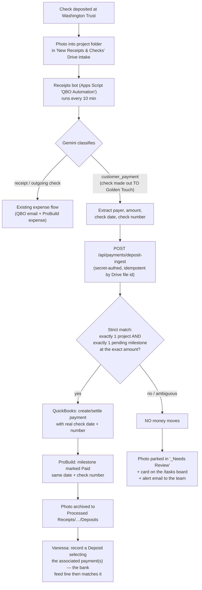
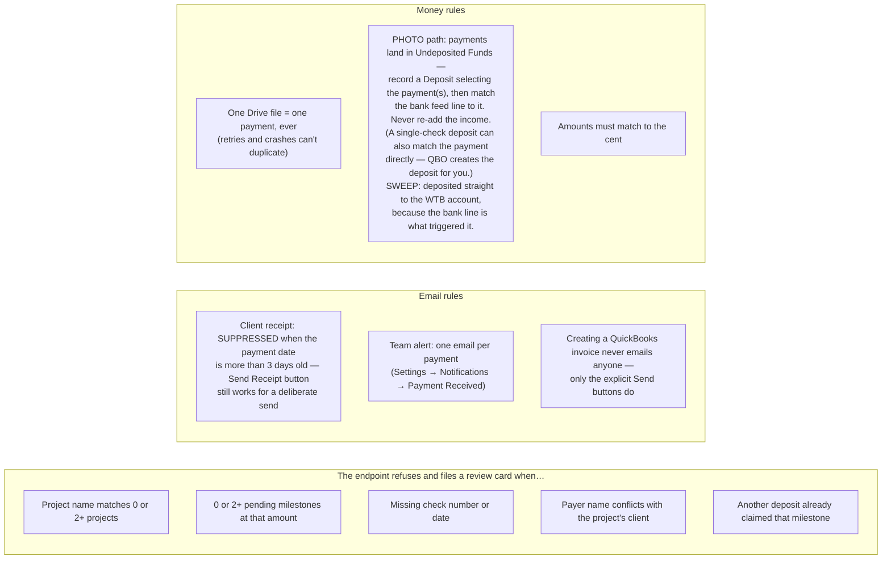
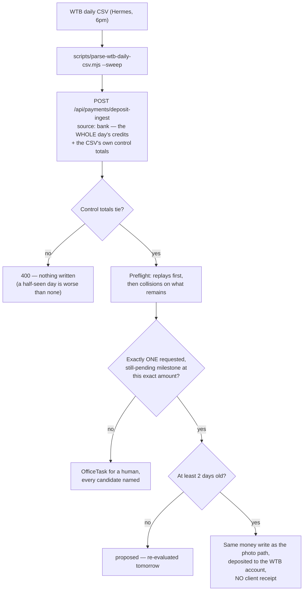
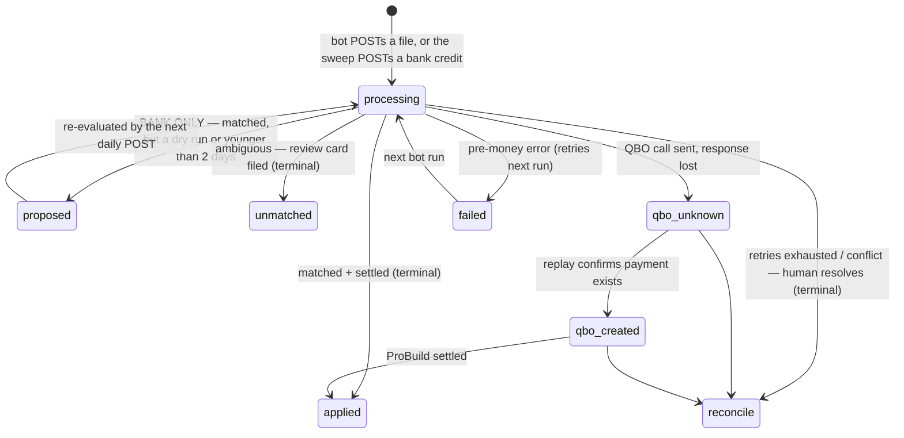

# Customer Deposit Pipeline — Reference

How a customer's check goes from a photo to being recorded in ProBuild **and** QuickBooks, with no customer emails and no double counting. Built August 2026 after the Berg late-recording incident.

**Two sources feed the same pipeline.** The photo path below is the fast one and the one that knows which project a check belongs to. The **deposit sweep** (September 2026) is the backstop: it reads the bank's own daily credit rows, so a deposit nobody photographed still gets booked instead of sitting unrecorded. Both run through the same endpoint, the same state machine and the same money writes — see "The deposit sweep" below.

## The one habit that drives everything

> **Deposit a check → same day, drop a photo of it into that project's folder inside the "New Receipts & Checks" Drive intake.**
> Email alternative: send it to the receipts address with `PO#<project>` in the subject.
> No project folder → the deposit parks for review instead of being guessed at.

## End-to-end flow

## Guardrails (why it can't double-pay or surprise a client)

## The deposit sweep (the no-photo backstop)

A check hit Washington Trust on 2026-08-24 for $13,447.68 (Hoppe, INV-00173). Nobody photographed it, so the photo path never fired, and the milestone sat Pending for nine days. A 2026-08-19 audit found $119,947.68 of deposits in exactly that state. The QuickBooks API cannot close this hole: it only exposes **booked** transactions, never the "For Review" bank feed, so an unbooked customer check is invisible to it until a human books it.

So the sweep reads the bank instead. The Hermes daily job (`wtb-daily-bank-export`, 6pm) already pulls the Washington Trust "Balances and Transactions" CSV and posts it to the ledger with `scripts/parse-wtb-daily-csv.mjs`. With `--sweep`, that same script also POSTs the day's **credit rows** to the same deposit endpoint, once per day, as one batch.

What makes a bank credit safe to book on an amount alone:

| Rule | Why |
|---|---|
| Candidates must be **requested** — `PaymentSchedule.qbInvoiceSentAt`, stamped only when the client email actually went out | This is what resolves the Hoppe case: three Pending milestones at exactly $13,447.68, only one ever asked for. A QBO invoice that exists but was never sent is **not** a candidate. |
| Uniqueness is taken over a **14-day union**: pending requested milestones at the amount **plus** anything at that amount settled recently by any source | If the photo path just booked this money, its milestone is now Paid and would otherwise be invisible. |
| Auto-apply also requires `qbInvoiceId` | The QuickBooks write needs the linked invoice; without it a human records it. |
| **Two-day wait**: a credit younger than that is held as `proposed`, counted in the COMPANY's calendar days (America/Los_Angeles) | A fresh check belongs to the photo path first — it knows the project. The day is the company's, not the server's: the job runs at 6pm Pacific, when UTC is already tomorrow, so a UTC reading gave a credit two days of age after one local day. A `proposed` row is deliberately **not** a claim against the photo path (it is outside that side's status list), or the wait would block the very path it exists to protect; when it is re-evaluated after the photo settles, the union rule and the applied-row lookup explain it to a human. |
| **Cross-source claim check**, inside the reservation transaction, on both paths | Stops the *other source* from reserving a **different** milestone for the same money while the first is in flight. Scoped to the other source on purpose: two photos at one amount each carry a project name, so they were never ambiguous and the photo path keeps its old behaviour. |
| **Deposit-class allowlist**: only BAI 174 / "OTHER DEPOSITS" whose Transaction Detail starts with `DEPOSIT` (branch) or `MOBILE D` (remote) is sweepable | A bank credit is any money in — owner capital, interest, an ACH refund, a transfer — and any of those can land on the exact cents of a requested milestone. Anything outside the allowlist is filed `unmatched` and never books; it only earns an OfficeTask when its amount matches a requested milestone, so routine interest is not daily noise. |
| **Control total must be the BANK's own**: a credit-bearing day with no TOTAL CREDITS row (BAI 100) is not swept at all | A sum derived from the rows it checks proves nothing — a day whose export silently dropped a deposit would tie perfectly. The runner logs "no TOTAL CREDITS control row, sweep skipped" and fails the job; the endpoint requires `creditSum` with no fallback. |
| **Batch cap**: 50 credits per POST, and `dryRun` must be a real boolean | A day is a handful of credits, and the whole batch runs sequentially inside one 60-second function; a bigger batch means a merged export and is refused (400) rather than half-processed. `dryRun: "true"` is a 400 too — a truthy string reading as LIVE is the wrong way round for the flag that stops money moving. |
| **Collision rule**: two different bank references, same day, same amount → both go to a human | A bank line carries nothing but an amount. Classified over the whole batch **including replays** and any stored same-day row in any status, and each verdict is written as a terminal `unmatched` row **before** matching starts — so a crash mid-batch cannot erase the collision and let the money auto-apply on tomorrow's replay. |
| Check images are corroboration only, looked up by bank reference (`<ref>:front`) | A branch-deposited check yields only a teller receipt and never names the payer, so evidence is a bonus, not a requirement. Two payer-bearing images for one reference is a conflict. |
| One bank reference = one `DepositIngest` row = one payment, ever (`fileId` is `bank:<reference>`) | The daily job re-posts the same day repeatedly; a replay returns the stored outcome and is never treated as a collision. |

Two deliberate differences in the money write, bank rows only:

- **`DepositToAccountRef` = the Washington Trust account** (QBO Account Id 154), not Undeposited Funds. The sweep's trigger *is* the bank line, and Vanessa matches the feed line to the payment.
- **No client receipt.** `suppressClientReceipt` rides the outbox row to the notifier. The back-date rule cannot cover this: a 2-day-old payment is well inside the 3-day cutoff, so without the flag the client would get a "Payment Confirmed" email for money no human has looked at. The team email and the activity log still fire. The flag is also **derived inside the shared settle** (`settleMilestoneFromQBPayment` asks whether a bank-sourced deposit owns the milestone), so a sweep that crashes after creating the QuickBooks payment still suppresses when the hourly sync finishes the settle instead.

Two things the unattended runner depends on:

- **A deterministic QuickBooks guard is a message, not a retry.** `balance-mismatch`, `invoice-not-found` and `missing-customer` file the credit for a human immediately, in plain language ("QuickBooks shows $0.00 owed on INV-00173, not $13,447.68; probably already booked. Verify and archive."). Retrying those eight times only delays the human and buries the reason.
- **The batch answers `ok` honestly.** The response carries counts for every outcome (applied, proposed, unmatched, reconcile, failed, qbo_unknown, replay) plus an `unresolved` **catch-all** for anything else — `qbo_created` after a settle threw, a busy `processing` row, a status that does not exist yet. `ok` is **false** whenever any credit is left outside applied / proposed / unmatched, and also whenever the buckets fail to add up to the credit count, because a success derived from an incomplete tally is the exact bug this guards. `unmatched` is a clean finish: asking a human is the sweep working. `parse-wtb-daily-csv.mjs --sweep` exits non-zero on `ok: false`, which is what makes the Hermes daily-job watchdog fire instead of a QuickBooks outage being logged as a healthy day. HTTP stays 200 for any batch that was processed; 400 is reserved for a payload that could not be trusted at all.

Rollout: Phase A is a shadow week (`--sweep-dry-run`, everything lands as `proposed`), with a 5-day exit gate before live auto-apply. Full rationale, including the residual race the guards narrow but do not close, is in `docs/plans/DEPOSIT-SWEEP-PLAN.md`.

## Where each piece lives

| Piece | Where |
|---|---|
| Endpoint (matching + money writes, BOTH sources) | `src/app/api/payments/deposit-ingest/route.ts` |
| Sweep rules (batch gate, collisions, wait rule, messages) | `src/lib/deposit-sweep.ts` |
| Sweep trigger (Hermes daily job) | `scripts/parse-wtb-daily-csv.mjs --sweep` / `--sweep-dry-run` |
| Sweep secret | `DEPOSIT_INGEST_SECRET` in the job's environment (same value as the bot's) |
| State machine table | `DepositIngest` (schema: `scripts/apply-deposit-ingest-schema.mjs`, then `scripts/apply-deposit-sweep-schema.mjs`) |
| QuickBooks payment helpers | `src/lib/quickbooks.ts` (`buildQBPaymentRequest` / `sendQBPaymentCreateRequest`) |
| ProBuild settle core | `src/lib/quickbooks-payments.ts` (`settleMilestoneFromQBPayment`), `src/lib/payment-record-core.ts` |
| Back-dated receipt suppression | `src/lib/payment-date.ts` + guards in `src/lib/payment-notifications.ts` |
| Bot (classify + route) | Apps Script project **"QBO Automation"** (owner jadkins@) — `runReceiptAutomation.gs`, deposit branch v3.7 |
| Bot secret | Script Property `DEPOSIT_INGEST_SECRET` (matches the Vercel env var) |
| Tests | `e2e/deposit-ingest.spec.ts` (photo cases + a bank-source block, QBO mocked), `tests/deposit-sweep.test.ts`, `tests/parse-wtb-daily-csv.test.ts` + bot harness `test-deposits.js` |
| Team alert toggle | ProBuild → Settings → Notifications → "Payment Received" |

## Manual fallback (what Vanessa/we do if the bot is down)

1. Find the deposit in the Washington Trust site — the deposit row's **Image → View** shows the actual check (payer, number, memo).
2. ProBuild: open the project invoice → milestone → **Record Payment** with the check's real date + number. Back-dated recordings do not email the client.
3. QuickBooks: receive the payment against the milestone invoice (create the invoice first from ProBuild's "QuickBooks Link" button if it doesn't exist; if the invoice is dated more than ~30 days after the deposit, edit its invoice date or QBO won't offer the match). Then per Vanessa's workflow: **record a Deposit selecting the associated payment(s)** — until the deposit is recorded, QuickBooks won't allow the bank-feed match. Single-check deposits can also be matched straight to the payment from the feed.

## State machine (endpoint internals, for debugging)

