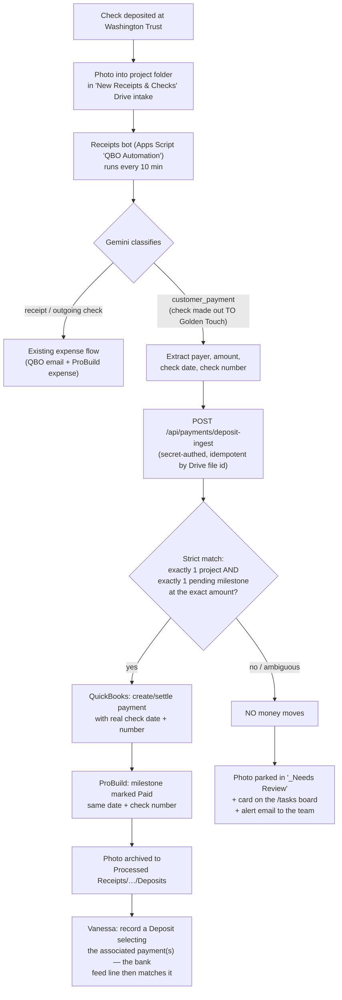
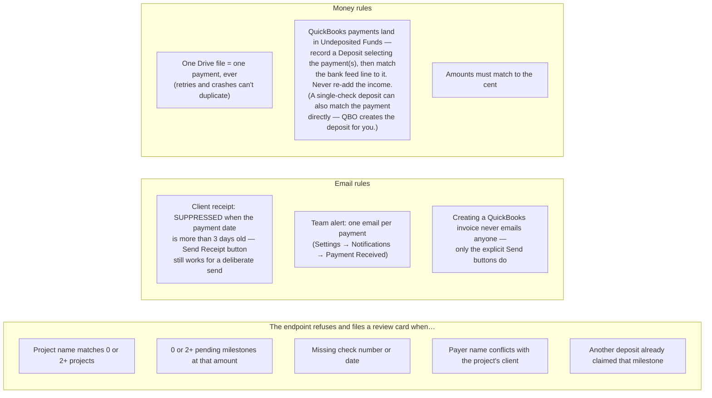
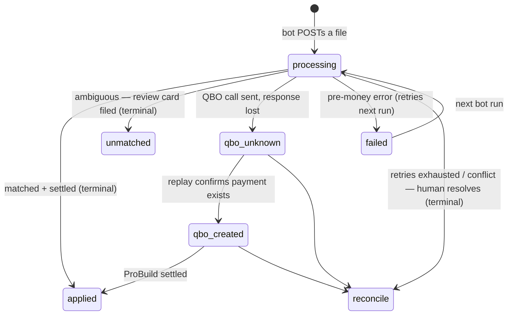

# Customer Deposit Pipeline — Reference

How a customer's check goes from a photo to being recorded in ProBuild **and** QuickBooks, with no customer emails and no double counting. Built August 2026 after the Berg late-recording incident.

## The one habit that drives everything

> **Deposit a check → same day, drop a photo of it into that project's folder inside the "New Receipts & Checks" Drive intake.**
> Email alternative: send it to the receipts address with `PO#<project>` in the subject.
> No project folder → the deposit parks for review instead of being guessed at.

## End-to-end flow

## Guardrails (why it can't double-pay or surprise a client)

## Where each piece lives

| Piece | Where |
|---|---|
| Endpoint (matching + money writes) | `src/app/api/payments/deposit-ingest/route.ts` |
| State machine table | `DepositIngest` (schema: `scripts/apply-deposit-ingest-schema.mjs`) |
| QuickBooks payment helpers | `src/lib/quickbooks.ts` (`buildQBPaymentRequest` / `sendQBPaymentCreateRequest`) |
| ProBuild settle core | `src/lib/quickbooks-payments.ts` (`settleMilestoneFromQBPayment`), `src/lib/payment-record-core.ts` |
| Back-dated receipt suppression | `src/lib/payment-date.ts` + guards in `src/lib/payment-notifications.ts` |
| Bot (classify + route) | Apps Script project **"QBO Automation"** (owner jadkins@) — `runReceiptAutomation.gs`, deposit branch v3.7 |
| Bot secret | Script Property `DEPOSIT_INGEST_SECRET` (matches the Vercel env var) |
| Tests | `e2e/deposit-ingest.spec.ts` (25 cases, QBO mocked) + bot harness `test-deposits.js` |
| Team alert toggle | ProBuild → Settings → Notifications → "Payment Received" |

## Manual fallback (what Vanessa/we do if the bot is down)

1. Find the deposit in the Washington Trust site — the deposit row's **Image → View** shows the actual check (payer, number, memo).
2. ProBuild: open the project invoice → milestone → **Record Payment** with the check's real date + number. Back-dated recordings do not email the client.
3. QuickBooks: receive the payment against the milestone invoice (create the invoice first from ProBuild's "QuickBooks Link" button if it doesn't exist; if the invoice is dated more than ~30 days after the deposit, edit its invoice date or QBO won't offer the match). Then per Vanessa's workflow: **record a Deposit selecting the associated payment(s)** — until the deposit is recorded, QuickBooks won't allow the bank-feed match. Single-check deposits can also be matched straight to the payment from the feed.

## State machine (endpoint internals, for debugging)

